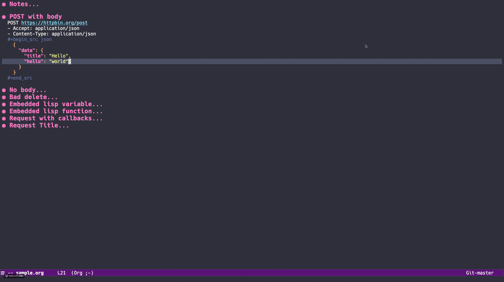

# Walkman

Write HTTP requests in Org mode and replay them at will using cURL



## Features
  * write HTTP requests as org mode "walkman entries"
  * execute walkman entries via curl
  * export walkman entries to a curl command
  * import curl command to walkman entries (beta)
  * support lisp variable or functions in a walkman entry
  * execute a series of lisp callbacks, passing the status code, headers, and response body

## Installation
Load up the `walkman.el` file.

## Usage
By default, after calling  `M-x walkman-mode`, these bindings will be added to org-mode:
```
C-c C-RETURN   to execute the enry at point
C-c C-'        for the walkman menu
```

## How to write a walkman entry
See the `sample.org` file for example of walkman entries.

The general structure is
```org
* Request Title
  GET/POST/PUT/... URL
  - Header1: value
  - Header2: value
  #+begin_src
    {
      "body": "in any mode/format"
    }
  #+end_src
  1. First Callback
     #+begin_src emacs-lisp
       (lambda (status headers body)
         (message "status %s, headers %s, body %s" status headers body))
     #+end_src
  2. Second Callback
     #+begin_src emacs-lisp
       (lambda (status headers body)
         (message "Second callback"))
     #+end_src
```
Note that only the HTTP action and URL are required, everything else is up to you.

### Simple GET request
```org
* Simple GET request
  GET https://httpbin.org/get
```

### Simple POST request with JSON body
```org
* Simple POST request
  POST https://httpbin.org/post
  - Accept: application/json
  - Content-Type: application/json
  #+begin_src json
    {
      "data": {
        "title": "Hello",
        "hello": "world"
      }
    }
  #+end_src
```

### Request with lisp variable
Define `my-http-status` with
```emacs-lisp
(setq my-http-status "400")
```
and run
```org
* Embedded lisp variable
  GET https://httpbin.org/status/`my-http-status`
```

### Request with callbacks
```org
* Request with callbacks
  POST https://httpbin.org/post
  #+begin_src json
    {
      "some": "body"
    }
  #+end_src
  1. First callback
     #+begin_src emacs-lisp
       (lambda (status headers body)
         (message "status %s, headers %s, body %s" status headers body))
     #+end_src
  2. Second callback
     #+begin_src emacs-lisp
       (lambda (status headers body)
         (pp (assoc 'url (json-read-from-string body))))
     #+end_src
```

## Customization

### Always keep the headers

If you don't want to bother with the `-v` flag to keep the headers in the response buffer, you can do
```
(setq walkman-keep-headers t)
```

### Custom key bindings

By default, running `walkman-mode` will run
```
(define-key org-mode-map (kbd "C-c C-'") #'walkman-transient)
(define-key org-mode-map (kbd "C-c <C-return>") #'walkman-at-point)
```

If you want to setup your own binding, don't run `walkman-mode` and instead bind
  * `walkman-at-point` for quick execution under the cursor
  * `walkman-transient` for the transient-based interactive menu

## TODO
  * insert response in org doc?
  * execute all requests sequentially
  * unit tests
  * option to run async
  * multiple backends

## Similar projects
  * [restclient](https://github.com/pashky/restclient.el)
  * [verb](https://github.com/federicotdn/verb)
